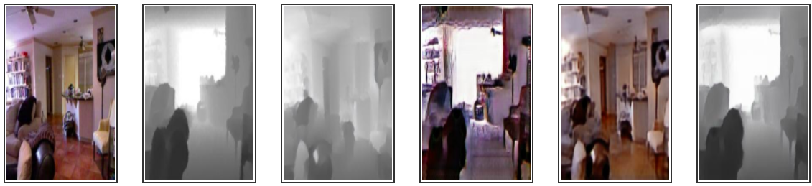

# Pix2Depth - Depth Map Estimation from Monocular Image

<div style="text-align:center"></div>

Estimating depth information from stereo images is easy, but does the same work for monocular images?
We did all the heavylifting so you don't have to do it. We have explored several methods to extract depth from monocular images. Pix2Depth is a culmination of things we've learnt thus far.

Pix2Depth uses several strategies to extract depth from RGB images. Of all the strategies used, Pix2pix and CycleGAN give the best results. Pix2Depth is trained on the NYU Depth Dataset. Pix2Depth is also trained to predict RGB images from depth map.

The web demo for Pix2Depth can be found [here](http://128.143.63.199:8010/)

The web demo has three sections:
* Pix2Depth - Using the models specified, give Pix2Depth an image and it will try to estimate the depth map.
* Depth2Pix - From the Models given, Input a depth map and Pix2Depth will predict the estimated colour for the image.
* Portrait Mode ( work in progress) - After obtaining the depth map, Pix2Depth uses the depth map to blur the background, so objects closer to the camera appear sharper while the background is blurred. This tries to emulate a potrait mode in smartphones without actually using stereo images.


## Dataset
The dataset for this repo can be downloaded [here](https://cs.nyu.edu/~silberman/datasets/nyu_depth_v2.html).

Place the downloaded file in the folder data/

**For the lazy**: run download_nyu_dataset.sh to automatically download the dataset. Run  `save_all_images.py` to store the images in seperate folders.

## Required Packages
* Keras
* Flask
* opencv
* h5py
* PIL
* numpy

## Running and evaluating

### Configurations
```
CONFIG = {
        'development': False,
        'host': [host],
        'port': [port_number],
        'pix2depth':{
                'first_option':'pix2pix',
                'second_option':'CycleGAN',
                'third_option':'CNN',
        },
        'depth2pix':{
                'first_option':'pix2pix',
                'second_option':'CycleGAN',
                'third_option':'MSCNN'
        },
        'portrait':{
                'first_option': 'pix2pix',
                'second_option': 'CycleGAN',
                'third_option': 'CNN'
        }
}

```

### Configure path to models

Loading the models stored in weights/ can be done inside `main.py` using model_list. This preloads all the models before inference hence saving a lot of time.

```
 model_list = {  
            'pix2depth':{ 
                'pix2pix' : load_model(),
                'CycleGAN':load_model(),
                'CNN': load_model(),
                },
            'depth2pix':{ 
                'pix2pix' : load_model(),
                'CycleGAN':load_model(),
                }
             }
```


### Importing Models


### Including Bootstrap Components

This demo requires Bootstrap (version 3). Bootstrap can be served to Flask from the static folder. The structure for storing the web-UI and images being displayed is as follows:

```
.
├── static
   ├── results
        └── results.jpg
        .
        .
        .
    └── uploads
        └── input.jpg
        .
        .
        .
   └── vendor
        └── bootstrap
                └── css
                └── js
        └── fonts
        └── jquery
```

### Running the Application

`python app.py`

### Examples
<div style="text-align:center"></div>
<div style="text-align:center"></div>
<div style="text-align:center"></div>
<div style="text-align:center"></div>


### Output
- `main.py` requires the path to the weights to load the model. The weights are stored in the folder weights/
- The images are stored with the name of the model so it's easier to identify results. The generated images are stored in static/results/ 

## Additional notes
* Used the following models to train on nyu_depth dataset.
    * [pix2pix](https://github.com/phillipi/pix2pix)
    * [CycleGan](https://github.com/junyanz/CycleGAN)
    * [Multi Scale CNN](https://github.com/alexhagiopol/multiscale-CNN-classifier)

